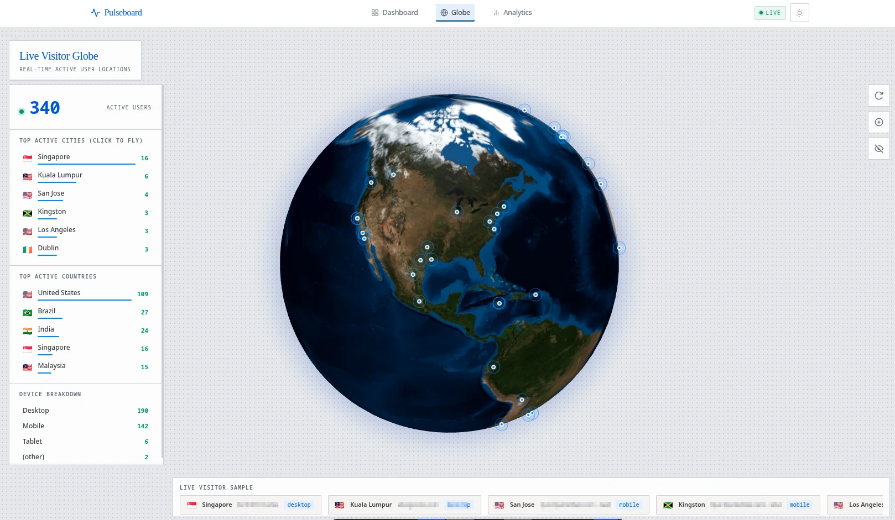
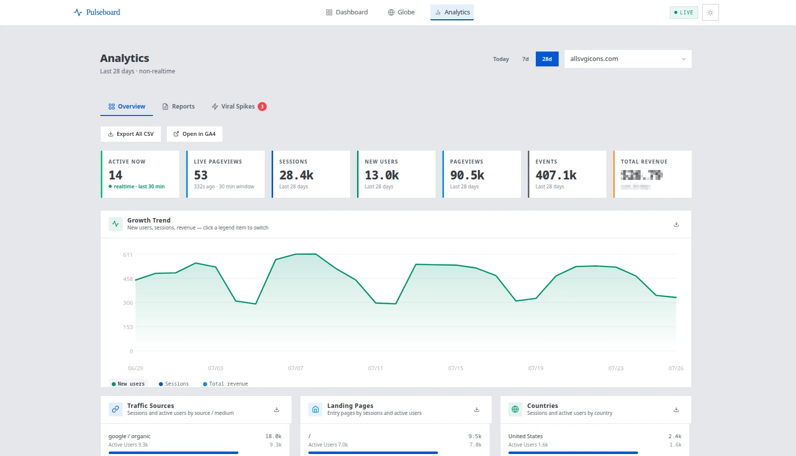
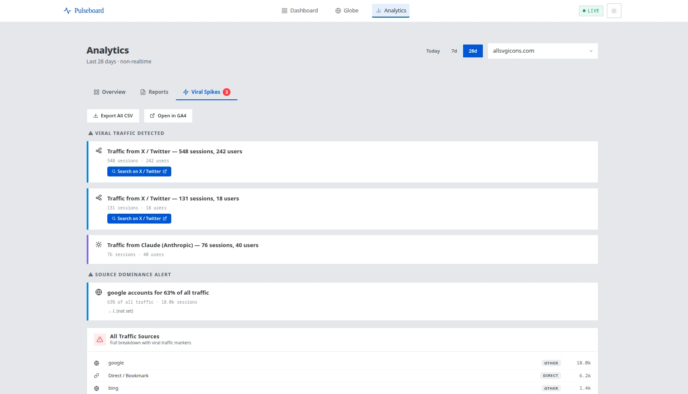
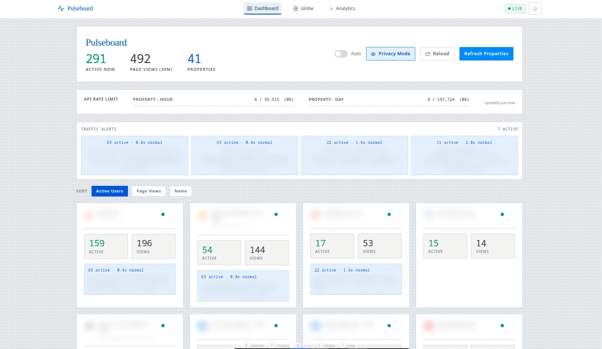

# GA4 Dashboard & MCP

Real-time Google Analytics 4 (GA4) dashboard featuring a 3D interactive globe visualization, traffic spike detection, visitor insights, and a standalone Model Context Protocol (MCP) server for AI assistants.



<details>
<summary>More screenshots</summary>





</details>

---

## Features

- **Real-time Analytics Dashboard**: Live active user monitoring, property comparison, traffic recipes, and quota tracking.
- **3D Interactive Globe**: Visualizes live website activity across world countries in real time using Three.js.
- **Spike Detection**: Automatically detects sudden traffic surges and classifies traffic sources (referral, direct, campaign).
- **Visitor Insights**: Aggregates persona cards for new vs. returning visitors, device breakdowns, and top geography.
- **Standalone MCP Server**: Query GA4 properties, funnels, and reports directly from AI tools (Claude Desktop, Antigravity, Cursor) — lives in `mcp-server/`, independent of the dashboard.
- **Privacy Shield**: Redacts full URL parameters and query strings to prevent private data leakage on dashboards.
- **Smart Caching & Quota Protection**: Disk + in-memory caching layers with automatic background property metadata updates to preserve GA4 API quota.
- **First-run setup page**: If no GA4 credentials are found, the dashboard shows a `/setup` page with the steps below instead of crashing.

---

## Prerequisites

- **Node.js**: v18.0.0 or higher
- **Package Manager**: [`pnpm`](https://pnpm.io/) (the dashboard uses a pnpm lockfile; `mcp-server/` is a separate npm package)
- **Google Cloud Platform (GCP) Account**: access to create a Service Account with Google Analytics API permissions

---

## Setup

### 1. Clone and install

```bash
git clone https://github.com/TheTechBasket/GA4_report.git
cd GA4_report
pnpm install
```

### 2. Create a Google Cloud service account

1. Open the [Google Cloud Console](https://console.cloud.google.com/) → **IAM & Admin → Service Accounts** and create a service account (or reuse one).
2. Enable the **Google Analytics Data API** and **Google Analytics Admin API** for that project.
3. On the service account's **Keys** tab, add a key → **JSON**. This downloads a file like `ga4dataapi-a1b2c3.json`.
4. In your [GA4 Admin Console](https://analytics.google.com/) → **Property Access Management**, add the service account's email (ends in `@...iam.gserviceaccount.com`) as a **Viewer**.

### 3. Place the key file

Copy the downloaded `ga4dataapi-*.json` into the project root, next to `app.js`. The dashboard resolves it automatically by filename pattern — no path to configure.

Prefer to keep the key elsewhere? Copy `.env.example` to `.env` and set `GA4_CREDENTIALS_PATH` to point at it instead:

```env
GA4_CREDENTIALS_PATH=/absolute/path/to/your-key.json
```

Key files matching `ga4dataapi-*.json` in the project root are already git-ignored — safe to drop in directly.

### 4. Start the app

```bash
pnpm dev     # development, with hot reload
pnpm start   # production
```

If no key is found yet, every route redirects to `/setup`, which walks through the steps above in the browser.

Once running:
- **Main Dashboard**: [http://localhost:3000](http://localhost:3000)
- **3D Globe View**: [http://localhost:3000/globe](http://localhost:3000/globe)
- **Analytics**: [http://localhost:3000/analytics](http://localhost:3000/analytics)

---

## Optional: the MCP server

`mcp-server/` is a standalone MCP server exposing GA4 Admin + Data API tools to MCP clients (Claude Desktop, Antigravity, Cursor). It's a separate package with its own dependencies and credentials — the dashboard above works without it.

```bash
cd mcp-server
pnpm install
cp .env.example .env
```

Set `GOOGLE_APPLICATION_CREDENTIALS` in `mcp-server/.env` to a key file path (can reuse the same `ga4dataapi-*.json` from step 2 above).

Then point your MCP client at it, e.g. Claude Desktop's `claude_desktop_config.json`:

```json
{
  "mcpServers": {
    "ga4": {
      "command": "node",
      "args": ["/absolute/path/to/GA4_report/mcp-server/index.js"]
    }
  }
}
```

See `mcp-server/README.md` for the full tool list and configuration details.

---

## Testing & building

```bash
pnpm test   # run the unit test suite (mocha)
pnpm build  # TypeScript compilation check
```

---

## License

Distributed under the [MIT License](LICENSE). See `LICENSE` for more information.

---

## Author

**Amit Yadav**
- GitHub: [@TheTechBasket](https://github.com/TheTechBasket)
- Repository: [https://github.com/TheTechBasket/GA4_report](https://github.com/TheTechBasket/GA4_report)
